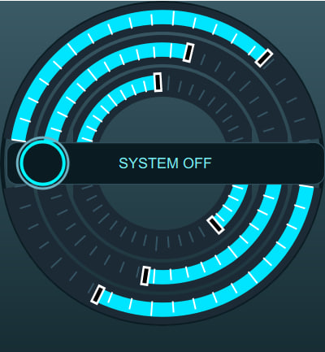
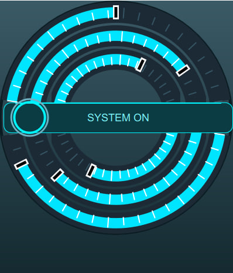

# Sci-Fi Arc Controls for Qt Quick

A set of futuristic arc-shaped slider controls and toggle buttons built with Qt Quick and Canvas. Perfect for sci-fi themed interfaces, control panels, and HUD displays.

## Features

- **ArcSoundSliderSciFi** — Arc-shaped slider with directional control (top/bottom)
- **SciFiToggleButton** — Circular toggle button with animated states
- **Overlay-compatible design** — Multiple controls can be nested in the same circular container
- **Canvas-based rendering** — Smooth, customizable graphics
- **Arc-shaped hit detection** — Only responds to clicks on the arc line, not rectangular area

## The Challenge: Overlapping Controls with Proper Mouse Handling

The main challenge was creating multiple interactive controls that **overlap within the same circular area** while maintaining correct mouse event handling.

### ❌ The Problem

In traditional Qt Quick layouts:
- Each `MouseArea` occupies a **rectangular** region
- When controls overlap, the top-most item captures all mouse events
- Arc-shaped controls don't align with rectangular hit areas
- Nested sliders (inner/outer arcs) need to receive events only when clicking **on the arc line**, not everywhere in their bounding rectangle

### ✅ The Solution

The key innovation is implementing **arc-shaped hit detection** within a rectangular MouseArea:

1. **Bounding box** — MouseArea is positioned around the arc path
2. **Hit testing** — Calculate distance from click point to arc center and compare with radius
3. **Tolerance zone** — Accept clicks within 30px of the arc line
4. **Event propagation** — Reject clicks outside the arc so they pass to underlying controls

### 🔑 Key Techniques

| Technique | Description |
|-----------|-------------|
| **Arc-shaped hit testing** | Reject mouse events outside tolerance from arc radius |
| **z-order management** | Inner sliders have higher z-index than outer ones |
| **Event propagation** | Use `propagateComposedEvents: true` and conditional `mouse.accepted` |
| **Coordinate transformation** | Convert local MouseArea coordinates to canvas coordinates |

## 🚀 Usage Example

// Outer arc (bottom layer)
ArcSoundSliderSciFi - radius: 180, direction: top, z: 1

// Inner arc (top layer) - receives events first
ArcSoundSliderSciFi - radius: 140, direction: top, z: 2

// Center toggle button
SciFiToggleButton - anchors.centerIn: parent, z: 10
text

## 🎮 Controls API

### ArcSoundSliderSciFi

| Property | Type | Description |
|----------|------|-------------|
| `value` | `real` | 0..1, current position |
| `radius` | `real` | Arc radius in pixels |
| `direction` | `string` | `"top"` or `"bottom"` |
| `trackColor` | `color` | Background track color |
| `activeColor` | `color` | Active arc color |
| `tickColor` | `color` | Inactive scale tick color |
| `activeTickColor` | `color` | Active scale tick color |
| `textColor` | `color` | Label text color |
| `hovered` | `bool` | Hover state |

**Signal:**
- `valueChangedByUser(int v)` — Emitted when user changes value (0-100)

### SciFiToggleButton

| Property | Type | Description |
|----------|------|-------------|
| `checked` | `bool` | Toggle state |
| `textOn` | `string` | Text when checked |
| `textOff` | `string` | Text when unchecked |
| `onColor` | `color` | Active ring color |
| `offColor` | `color` | Panel color when off |
| `ringOuterColor` | `color` | Outer ring accent color |
| `textColor` | `color` | Label color |

**Signal:**
- `toggled(bool value)` — Emitted when state changes

## 🎨 Why Canvas?

| Reason | Benefit |
|--------|---------|
| **Performance** | Single draw call per control vs multiple shape objects |
| **Precision** | Fine control over glow effects and gradients |
| **Compatibility** | Works with Qt 5.12+ without Qt Graphical Effects |
| **Simplicity** | All drawing logic in one `onPaint` handler |

## 📋 Requirements

- Qt 5.12 or higher
- Qt Quick 2.12 or higher

## 💻 Installation

1. Copy the `.qml` files to your project directory
2. Import and use them in your QML files

## 📄 License

MIT License 2026

---

⭐ **Star this repo** if you find it useful!  
🐛 Found a bug? [Open an issue](../../issues)  
💡 Have an idea? [Submit a PR](../../pulls)

---
